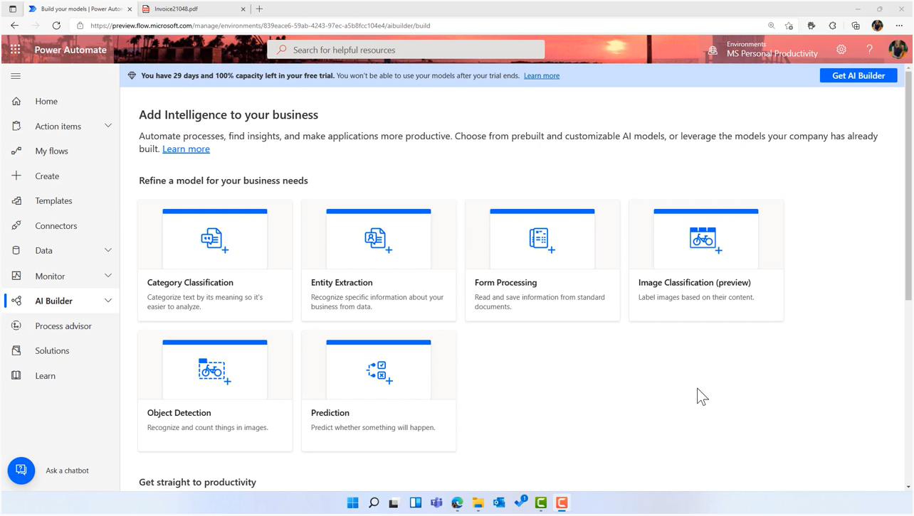

## Section 4: 
Further recommendations will include forecasting and operational efficiency which can be achieved using AI solutions

* Starting with an **Azure Machine Learning code-based solution** to show future forecasting of activity in London boroughs which can help Tailwind Traders make decisions on where to place new stores given the pandemic changes to activity
* Talking about the pro's and con's of using a code-based solution and introducing the **no-code opportunity with AI Builder** as a part of the Power Platform
* **Building a forms recognizer solution** for analysing Tailwind Traders receipts and invoices with no-code (using AI Builder and Power Automate)

[Link to slides](https://gaicstor2020.blob.core.windows.net/amy-ppts/ImplementingAIendtoendinthecloudwithAzure.pptx)

## AI Builder Demo
Review how we built and implemented our AI Builder Forms Recogniser model without writing a line of code: [Video link](https://youtu.be/6IomHEWQ7t8)

## Extra Reading Links:

* Microsoft Learn Modules (Self paced learning) [AI Builder](https://docs.microsoft.com/en-gb/learn/browse/?WT.mc_id=webupdates_GEP_PowerAutomate-web-wwl&products=ai-builder)
* AI Builder [Documentation](https://docs.microsoft.com/en-gb/ai-builder/overview)